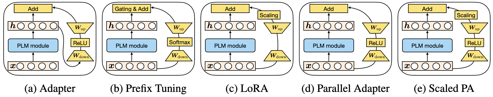

# A Unified Framework for Parameter-Efficient Transfer Learning
This is the official implementation of the [paper](https://arxiv.org/abs/2110.04366):

```
Towards a Unified View of Parameter-Efficient Transfer Learning
Junxian He*, Chunting Zhou*, Xuezhe Ma, Taylor Berg-Kirkpatrick, Graham Neubig
ICLR 2022 (spotlight)
```

Parameter-efficient transfer learning (PETL) methods only tune a small number of (extra) parameters to adapt large pretrained models into downstream tasks. This paper reveals the connection among existing PETL methods such as adapters, prefix tuning, and LoRA, and proposes a unified framework to interpret their designs. This unified framework is able to instantiate existing approaches by varying values along several defined design dimensions, which also provides principled guidance to design new PETL methods. In this repo as well as in the paper, we include examples of how we easily derive new state-of-the-art PETL methods from the unified framework.



## Updates

**Mar 24, 2022**

Our MAM adapter and parallel adapter are integrated into the [adapter-transformers](https://github.com/Adapter-Hub/adapter-transformers) package (thanks to their developers!), please check their [release blog](https://adapterhub.ml/blog/2022/03/adapter-transformers-v3-unifying-efficient-fine-tuning/) on the details. With adapter-transformers, you may apply MAM adapter or parallel adapter to a wide variety of tasks and pretrained models easily, for example, the code below sets up a MAM adapter based on a pretrained model:
```python
# this is a usage case based on the adapter-transformer package, not this repo
from transformers.adapters import MAMConfig

config = MAMConfig()
model.add_adapter("mam_adapter", config=config)
```

## Dependencies

This repo is a fork of the [huggingface transformers](https://github.com/huggingface/transformers) repo (forked on June 23, 2021), and the code is tested on [PyTorch](https://pytorch.org) 1.9.0. Please follow the instructions below to install dependencies after you set up PyTorch:

```bash
git clone git@github.com:jxhe/unify-parameter-efficient-tuning.git
cd unify-parameter-efficient-tuning

# install transformers from this repo
pip install -e .

# install other requirements
pip install datasets==1.11.0

# used to compute BLEU score for en-ro translation
git clone git@github.com:moses-smt/mosesdecoder.git
```


## Usage

#### MAM-Adapter

Run the following command to reproduce the MAM-Adapter results in the paper on the XSum, en-ro translation, MNLI, or SST2 datasets:

```bash
bash exps/run_{xsum|en_ro|glue}.sh
```

We ran all the experiments with one A6000 or A100 GPU that has >=40GB GPU memory -- if your GPU does not have a large memory, you may need to reduce the `bsz` (`max_tokens_per_batch` for en-ro) and increase the `gradient_steps` values in the scripts to match our effective batch size. You may train with multiple GPUs easily with `python -m torch.distributed.launch --nproc_per_node {num_gpus} ` to enable data parallelism. 

*Training time:* in our experiments that use one GPU, XSum takes 24 hours w/ A100 or 50 hours w/ A6000, en-ro takes 20 hours w/ A6000, SST2 takes 2 hours, and MNLI takes 10 hours.

#### Advanced Usage for Other PETL Variants
As the paper shows, our unified framework instantiates different PETL variants easily by varying along the design dimensions. You can modify the script to train other PETL variants as we studied in the paper, we include some examples in `run_xsum.sh`, which can be directly applied to the other scripts as well:

```bash
# ----- MAM adapter -----
attn_mode="prefix"
attn_option="concat"
attn_composition="add"
attn_bn=30  # attn bottleneck dim

ffn_mode="adapter"
ffn_option="parallel"
ffn_adapter_layernorm_option="none"
ffn_adapter_init_option="lora"
ffn_adapter_scalar="4"
ffn_bn=512 # ffn bottleneck dim

# ----- prefix tuning baseline -----
# attn_mode="prefix"
# attn_option="concat"
# attn_composition="add"
# attn_bn=200  # attn bottleneck dim

# ffn_mode="none"
# ffn_option="parallel"
# ffn_adapter_layernorm_option="none"
# ffn_adapter_init_option="lora"
# ffn_adapter_scalar="4"
# ffn_bn=512 # ffn bottleneck dim

# ----- Houlsby Adapter -----
# attn_mode="adapter"
# attn_option="sequential"
# attn_composition="add"
# attn_bn=200  # attn bottleneck dim

# ffn_mode="adapter"
# ffn_option="sequential"
# ffn_adapter_layernorm_option="none"
# ffn_adapter_init_option="bert"
# ffn_adapter_scalar="1"
# ffn_bn=200 # ffn bottleneck dim


# ----- FFN Scaled Parallel Adapter -----
# attn_mode="none"
# attn_option="parallel"
# attn_composition="add"
# attn_bn=200  # attn bottleneck dim

# ffn_mode="adapter"
# ffn_option="parallel"
# ffn_adapter_layernorm_option="none"
# ffn_adapter_init_option="lora"
# ffn_adapter_scalar="4"
# ffn_bn=512 # ffn bottleneck dim

# ----- Prompt Tuning -----
# attn_mode="prompt_tuning"
# attn_option="parallel"
# attn_composition="add"
# attn_bn=200  # attn bottleneck dim

# ffn_mode="none"
# ffn_option="parallel"
# ffn_adapter_layernorm_option="none"
# ffn_adapter_init_option="lora"
# ffn_adapter_scalar="4"
# ffn_bn=512 # ffn bottleneck dim

# ----- bitfit -----
# attn_mode="bitfit"
# attn_option="parallel"
# attn_composition="add"
# attn_bn=200  # attn bottleneck dim

# ffn_mode="none"
# ffn_option="parallel"
# ffn_adapter_layernorm_option="none"
# ffn_adapter_init_option="lora"
# ffn_adapter_scalar="4"
# ffn_bn=512 # ffn bottleneck dim

# ----- lora -----
# attn_mode="lora"
# attn_option="none"
# attn_composition="add"
# attn_bn=16

# # set ffn_mode to be 'lora' to use
# # lora at ffn as well

# ffn_mode="none"
# ffn_option="none"
# ffn_adapter_layernorm_option="none"
# ffn_adapter_init_option="bert"
# ffn_adapter_scalar="1"
# ffn_bn=16

# lora_alpha=32
# lora_dropout=0.1
# lora_init="lora"
```

There are more variations than what is shown above. Please see a complete explanation of these arguments [here](https://github.com/jxhe/unified-parameter-efficient-tuning/blob/25b44ac0e6f70e116af15cb866faa9ddc13b6c77/petl/options.py#L45) in `petl/options.py`. The results of all the variants reported in the paper could be reproduced by changing these values in the scripts.


## Citation

```
@inproceedings{he2022towards,
title={Towards a Unified View of Parameter-Efficient Transfer Learning},
author={Junxian He and Chunting Zhou and Xuezhe Ma and Taylor Berg-Kirkpatrick and Graham Neubig},
booktitle={International Conference on Learning Representations},
year={2022},
url={https://openreview.net/forum?id=0RDcd5Axok}
}
```


